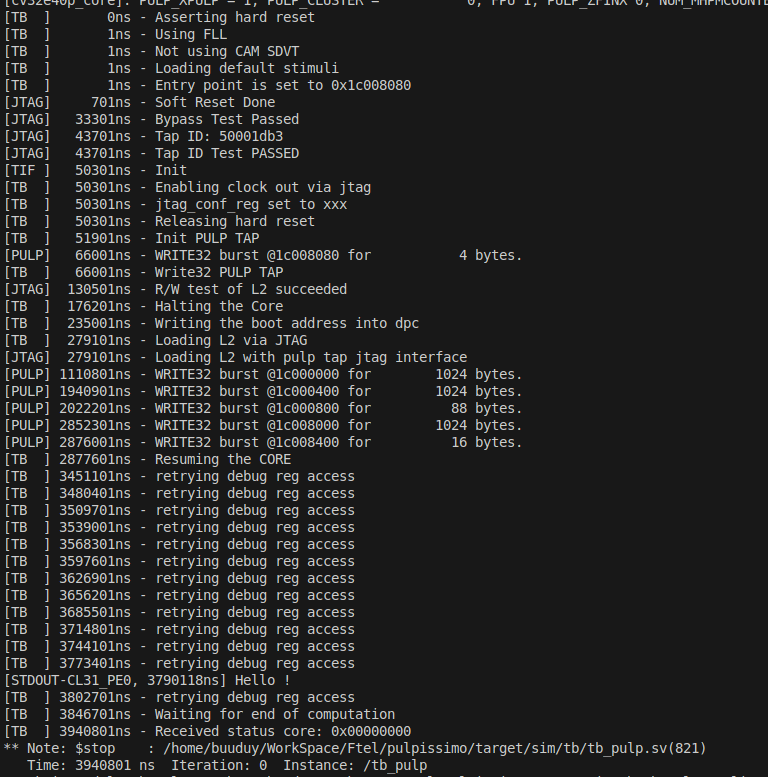

# 📝 PULPissimo Setup, Run, and Fixes Guide

* **Author:** Truong Buu Duy
* **Date:** November 11, 2025

---

### Introduction

This document records the steps to install and run simulations for the **PULPissimo** project. The main purpose is to document common errors encountered when running simulations with **Questasim** and to provide specific solutions for fixing the Tcl scripts.

* **Original Project:** `https://gitlab.com/anhnt232/pulpissimo.git`

---

### 1. Environment Setup

1.  **Clone the PULPissimo repository:**
    ```bash
    git clone https://gitlab.com/anhnt232/pulpissimo.git
    ```

2.  **Install Bender (Package Manager):**
    ```bash
    # Go to the utils/bin directory
    cd pulpissimo/utils/bin
    
    # Extract Bender
    tar -xzf bender-0.28.0-x86_64-linux-gnu-ubuntu18.04.tar.gz
    
    # Make it executable
    chmod +x bender
    
    # Verify installation
    ./bender --version
    ```

3.  **Clone the Runtime Examples (pulp-rt-examples):**
    ```bash
    # Go back to the pulpissimo root directory
    cd ../../
    
    # Clone the examples
    git clone https://github.com/pulp-platform/pulp-rt-examples.git
    ```

4.  **Install the RISC-V Toolchain:**
    ```bash
    # Go outside the pulpissimo directory
    cd ../
    
    # Follow the official guide at:
    # https://github.com/pulp-platform/riscv-gnu-toolchain
    ```

---

### 2. Compile and Run

1.  **Build the project:**
    ```bash
    cd pulpissimo
    make build
    ```

2.  **Set environment variables:**
    ```bash
    # Set the path to the Questasim simulation
    export VSIM_PATH=/home/buuduy/WorkSpace/Ftel/pulpissimo/build/questasim
    # ⚠️ Note: Replace /home/buuduy/... with your absolute path
    
    export VSIM="vsim"
    
    # Set the path to the RISC-V toolchain
    export PULP_RISCV_GCC_TOOLCHAIN=$HOME/riscv
    # ⚠️ Note: Replace $HOME/riscv if your path is different
    
    export PATH=$PULP_RISCV_GCC_TOOLCHAIN/bin:$PATH

    # ⚠️ IMPORTANT NOTE:
    # You should only export these variables temporarily for your current session.
    # Do NOT add them to your ~/.bashrc file, as this may affect your Questasim license.
    ```

3.  **Run the 'hello' example:**
    ```bash
    # Source the configuration file to enable core
    source sw/pulp-runtime/configs/pulpissimo_cv32.sh
    
    # Go to the example directory
    cd pulp-rt-examples/hello
    
    # Clean, build, and run
    make clean && make all && make run
    ```
    

---

### 3. 🐞 Questasim Simulation Fixes (Error and Solution) (IF ANY)

**Error: Library `rtl_work` not found**

* **Error message (or similar):**
    ```
    ** Error (vsim-19) Failed to access library './rtl_work' at "./rtl_work".
    ```
* **Solution (File: `pulpissimo/build/questasim/tcl_files/config/vsim.tcl`):**
    Modify the `set vsim_cmd` line to explicitly specify the library path (`-lib`).

    **FROM:**
    ```tcl
    set vsim_cmd "vsim -c -quiet $TB \
    ```
    **TO:**
    ```tcl
    set vsim_cmd "vsim -c -quiet -lib /home/buuduy/WorkSpace/Ftel/pulpissimo/build/questasim/rtl_work $TB \
    ```
    (⚠️ **Note:** Replace `/home/buuduy/WorkSpace/Ftel/pulpissimo/...` with your absolute path)
